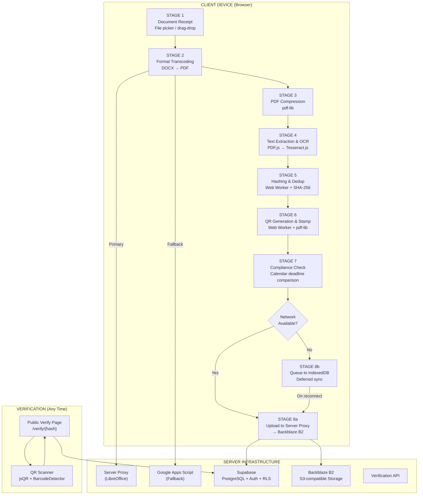
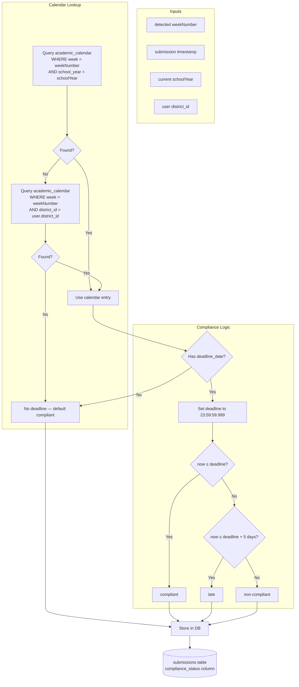

# PATENT DRAWINGS — FIG. 1 through FIG. 8

## FIG. 1 — High-Level Pipeline Architecture



---

## FIG. 2 — Document Submission Process Flowchart

```mermaid
flowchart TB
    START([User selects document]) --> FT{File Type?}
    FT -->|PDF| CP[Load PDF bytes]
    FT -->|DOCX/DOC| TRY1[Try Server Proxy<br/>POST /api/convert]
    
    TRY1 --> PROXY_OK{Success?}
    PROXY_OK -->|Yes| CP
    PROXY_OK -->|No| TRY2[Fallback: Google Apps Script<br/>Base64 → Drive → Docs API → PDF]
    TRY2 --> GAS_OK{Success?} -->|Yes| CP
    GAS_OK -->|No| ERR1[Error: Conversion failed]

    CP --> CHECK_SIZE{File >2MB<br/>or not slow connection?}
    CHECK_SIZE -->|Yes| COMP[Compress PDF<br/>via pdf-lib]
    CHECK_SIZE -->|No| SKIP[Skip compression]

    COMP --> TXT_TRY[Try PDF.js text extraction]
    SKIP --> TXT_TRY
    TXT_TRY --> PDFJS_OK{Text found?}
    PDFJS_OK -->|Yes| EXTRACT[Use extracted text]
    PDFJS_OK -->|No| RASTER[Render pages to Canvas]
    RASTER --> OCR[Tesseract.js OCR<br/>eng+fil models]
    OCR --> EXTRACT

    EXTRACT --> PARSE[Parse metadata]
    PARSE --> REGEX[Regex patterns<br/>DLL/ISP/ISR, week, year]
    REGEX --> DICE[Dice coefficient<br/>subject/grade matching]
    DICE --> NB[Naive Bayes<br/>doc type + subject]
    NB --> META[Metadata identified]

    META --> WH[Web Worker: COMPRESS_AND_HASH]
    WH --> HASH[SHA-256 hash computed]

    HASH --> DUP1{Check local<br/>IndexedDB cache}
    DUP1 -->|Duplicate| ERR2[Error: Duplicate detected]
    DUP1 -->|Not found| DUP2{Check server DB<br/>file_hash match}
    DUP2 -->|Duplicate| ERR2
    DUP2 -->|Not found| DUP3{Check slot<br/>load+week+type?}
    DUP3 -->|Taken| ERR2
    DUP3 -->|Free| QR_GEN[Web Worker: STAMP_QR]
    
    QR_GEN --> QR[Generate QR code<br/>URL: /verify/{hash}]
    QR --> STAMP[Stamp QR on PDF<br/>bottom-right, 72px, 30px margin]
    STAMP --> CAL{Calendar entry<br/>for week + district?}
    CAL -->|Found| DEADLINE[Get deadline_date]
    DEADLINE --> COMPARE{Submission<br/>≤ deadline?}
    COMPARE -->|Yes| COMPLIANT[Status: compliant]
    COMPARE -->|No| GRACE{Within<br/>5-day grace?}
    GRACE -->|Yes| LATE[Status: late]
    GRACE -->|No| NONCOMP[Status: non-compliant]
    CAL -->|Not found| DEFAULT[Status: compliant]

    COMPLIANT --> UPLOAD[Upload QR-stamped PDF<br/>to /api/storage/upload]
    LATE --> UPLOAD
    NONCOMP --> UPLOAD
    DEFAULT --> UPLOAD

    UPLOAD --> B2[Backblaze B2 storage<br/>submissions/{user}/{type}/{ts}_{file}]
    B2 --> DB[Insert DB record<br/>file_hash, metadata, compliance]
    DB --> DONE([Success])
    ERR1 --> DONE_FAIL([Failure])
    ERR2 --> DONE_FAIL
```

---

## FIG. 3 — Dual-Path Text Extraction & Metadata Parsing

```mermaid
flowchart TB
    subgraph INPUT["Input Document (PDF)"]
        PDF[PDF bytes]
    end

    subgraph PATH1["PRIMARY PATH — PDF.js Text Extraction"]
        direction TB
        P1[Load PDF.js from CDN] --> P2[Render each page]
        P2 --> P3[Extract text layer via API]
        P3 --> P4{Extraction<br/>successful?}
        P4 -->|Yes| TEXT[Extracted text]
    end

    subgraph PATH2["FALLBACK PATH — Tesseract.js OCR"]
        direction TB
        T1[Render PDF page to HTML Canvas] --> T2[Convert Canvas to Blob]
        T2 --> T3[Create Tesseract.js worker<br/>Language: eng+fil]
        T3 --> T4[Run OCR on each page blob]
        T4 --> T5[Layout analysis + line detection]
        T5 --> T6[Character segmentation + recognition]
        T6 --> T7[Output: text + confidence scores]
    end

    subgraph PARSER["Metadata Parsing Engine"]
        direction TB
        R[Regex Pattern Matcher:<br/>DLL/ISP/ISR markers<br/>Week # indicators<br/>School year ranges<br/>Date fields<br/>Grade level]
        D[Dice Coefficient Fuzzy Matcher:<br/>Subject names vs reference list<br/>Grade levels vs reference list<br/>Threshold: 0.4]
        N[Naive Bayes Classifier:<br/>Subject prediction model<br/>Doc type prediction model<br/>Word frequency from JSON]
    end

    subgraph OUTPUT["Extracted Metadata"]
        M1[docType: DLL | ISP | ISR | Unknown]
        M2[weekNumber: 1-40]
        M3[schoolYear: e.g. 2024-2025]
        M4[subject: string + confidence]
        M5[gradeLevel: string]
        M6[teacher: string]
        M7[date: ISO date string]
        M8[dateRange: start + end]
        M9[language: English | Filipino]
        M10[rawText: full extracted text]
    end

    PDF --> PATH1
    P4 -->|No / insufficient| PATH2
    PATH2 --> TEXT
    TEXT --> R
    R --> D
    D --> N
    N --> OUTPUT
```

---

## FIG. 4 — Cryptographic Verification System

```mermaid
flowchart TB
    subgraph SCAN["QR Code Scanning"]
        QR_IN[Document with QR code] --> CAM[Camera scan or image upload]
        CAM --> DECODE[Decode QR via jsQR / BarcodeDetector]
        DECODE --> PARSE_URL[Parse verification URL<br/>Format: /verify/{SHA256_HASH}]
        PARSE_URL --> HASH_EXT[Extract SHA-256 hash]
    end

    subgraph TIER1["TIER 1 — Offline Cache Check"]
        direction TB
        O1[Query IndexedDB cache<br/>key: cached_docs_{hash}] --> O2{Found?}
        O2 -->|Yes| O3[Display cached metadata<br/>file_name, doc_type, etc.]
        O2 -->|No| O4[Cache miss — proceed to Tier 2]
    end

    subgraph TIER2["TIER 2 — Server Database Query"]
        direction TB
        S1[Query Supabase submissions table<br/>WHERE file_hash = {hash}] --> S2{Record found?}
        S2 -->|Yes| S3[Display metadata:<br/>name, type, status, date,<br/>teacher, school, grade]
        S2 -->|No| S4[Not found result]
    end

    subgraph RESULT["Verification Result"]
        R1[✓ Verified - Hash matches]
        R2[⚠ Tampered - Hash mismatch]
        R3[✗ Not Found - No record]
    end

    HASH_EXT --> O1
    O4 --> S1
    O3 --> R1
    S3 --> R1
    S4 --> R3
```

---

## FIG. 5 — Offline-First Queuing & Auto-Sync System

```mermaid
flowchart TB
    subgraph ONLINE["ONLINE — Normal Flow"]
        N[Pipeline Stages 1-6 execute normally] --> UPLOAD_ON[Stage 8: Upload to server]
        UPLOAD_ON --> DONE_SUCC[Success]
    end

    subgraph OFFLINE["OFFLINE — Deferred Flow"]
        O[Pipeline Stages 1-6 execute normally] --> QUEUE[Stage 8b: Enqueue to IndexedDB]
        QUEUE --> Q_ITEM[Queue item stored:<br/>key: sync_queue_{ts}_{hash}<br/>pdfBytes, fileHash, metadata]
        Q_ITEM --> PENDING[pendingSyncCount++]
    end

    subgraph SYNC["AUTO-SYNC TRIGGERS"]
        direction TB
        EV1[window 'online' event<br/>+ 3-second stabilization]
        EV2[visibilitychange → visible<br/>+ online check]
        EV3[window 'focus' event<br/>+ online check]
        EV4[Periodic heartbeat<br/>every 60 seconds]
    end

    subgraph PROCESS["QUEUE PROCESSOR"]
        direction TB
        P1[Get all queue items<br/>sorted by timestamp] --> P2{Re-validate<br/>slot & hash<br/>on server}
        P2 -->|Already exists| P3[Remove from queue<br/>Mark as synced]
        P2 -->|Available| P4[Upload to server proxy]
        P4 --> P5{Upload OK?}
        P5 -->|Yes| P6[Insert DB record<br/>Delete queue item]
        P5 -->|No| P7[Keep in queue<br/>for retry]
        P3 --> P8[Next item]
        P6 --> P8
        P7 --> P8
    end

    EV1 --> P1
    EV2 --> P1
    EV3 --> P1
    EV4 --> P1
```

---

## FIG. 6 — Dual-Path Transcoding System (DOCX → PDF)

```mermaid
flowchart TB
    subgraph CLIENT_SIDE["Client Device"]
        DOCX[Original .docx file] --> TRY_PROXY[Primary: POST to /api/convert]
        DOCX --> TRY_GAS[Fallback: POST to Google Apps Script]
    end

    subgraph PROXY["PRIMARY PATH — Server Proxy (LibreOffice)"]
        direction TB
        SP[Receive file as multipart FormData<br/>Auth: Bearer token] --> LO[Invoke:<br/>soffice --headless --convert-to pdf]
        LO --> RETURN_PDF[Return PDF bytes]
        RETURN_PDF --> PROXY_OK{Success?}
    end

    subgraph FALLBACK["FALLBACK PATH — Google Apps Script"]
        direction TB
        GAS[Receive base64 + fileName in JSON] --> DRIVE[Create temp file in Google Drive<br/>MIME: application/vnd.google-apps.document]
        DRIVE --> DOCS[Open via Google Docs API<br/>Auto-converts DOCX → Google Doc]
        DOCS --> EXPORT[Export as PDF via Drive API]
        EXPORT --> B64[Base64-encode the PDF bytes]
        B64 --> CLEAN[Delete temp file from Drive]
        CLEAN --> RETURN[Return JSON: {success, pdfBase64}]
    end

    subgraph CLIENT_RECEIVE["Client Device"]
        CR1{Primary OK?} -->|Yes| USE_PDF[Use PDF bytes<br/>as Uint8Array]
        CR1 -->|No| TRY_GAS
        RETURN --> CR2{Success?}
        CR2 -->|Yes| USE_PDF
        CR2 -->|No| ERR[Error: Conversion failed]
    end

    PROXY_OK -->|Yes| CR1
    PROXY_OK -->|No| TRY_GAS
```

---

## FIG. 7 — Compliance Determination Module



---

## FIG. 8 — System Architecture

```mermaid
flowchart TB
    subgraph CLIENT_ARCH["CLIENT DEVICE"]
        direction TB
        UI[SvelteKit Web App<br/>Tailwind CSS UI]
        PW[Progressive Web App<br/>Service Worker + Manifest]
        WW[Web Worker (PdfWorker)<br/>COMPRESS_AND_HASH<br/>STAMP_QR]
        IDB[IndexedDB<br/>idb-keyval<br/>Queue + Cache]
        OCR2[Tesseract.js WASM<br/>eng+fil OCR Engine]
        PDFJS[PDF.js<br/>Text Extraction]
    end

    subgraph API["SERVER PROXY ENDPOINTS"]
        CONV[POST /api/convert<br/>LibreOffice DOCX→PDF]
        STORE[POST /api/storage/upload<br/>Proxy upload to B2]
        PRESIGN[GET /api/storage/presign<br/>Pre-signed download URLs]
    end

    subgraph SUPABASE["SUPABASE BACKEND"]
        PG[(PostgreSQL<br/>submissions table<br/>profiles table<br/>teaching_loads table<br/>academic_calendar)]
        AUTH[Auth Service<br/>JWT + Email/Password]
        RLS[Row-Level Security<br/>Teacher: self only<br/>School Head: school<br/>District Supervisor: district]
    end

    subgraph STORAGE["CLOUD STORAGE"]
        B2[Backblaze B2<br/>S3-compatible<br/>Path: submissions/{user}/{type}/{file}]
    end

    subgraph GAS["FALLBACK SERVICE"]
        GAS_SCRIPT[Google Apps Script<br/>doPost(): DOCX→PDF<br/>Drive API + Docs API]
    end

    subgraph VERIFY_PAGE["VERIFICATION"]
        VP[/verify/{hash} page<br/>Offline cache → DB query<br/>QR scanner (jsQR + BarcodeDetector)]
    end

    UI --> CONV
    UI --> STORE
    UI --> VP
    UI --> PG
    UI --> AUTH
    CONV --> LIBRE[LibreOffice headless]
    CONV --> GAS_SCRIPT
    STORE --> B2
    PG --> RLS
    WW --> IDB
    UI --> WW
    OCR2 --> UI
    PDFJS --> UI
```

---

## LEGEND

| Symbol | Meaning |
|---|---|
| Rectangle | Process / Action |
| Diamond | Decision / Branch |
| Cylinder | Database / Storage |
| Rounded rect | Start / End |
| Subgraph | Logical grouping |
| Dashed line | Fallback / Alternative path |
| Solid line | Primary flow |

---

*These diagrams correspond to FIG. 1 through FIG. 8 as referenced in the Detailed Description of the Invention in the patent application. All processes shown are implemented in the source code at github.com/MathewAndreiAbao/SmartEvision.*
