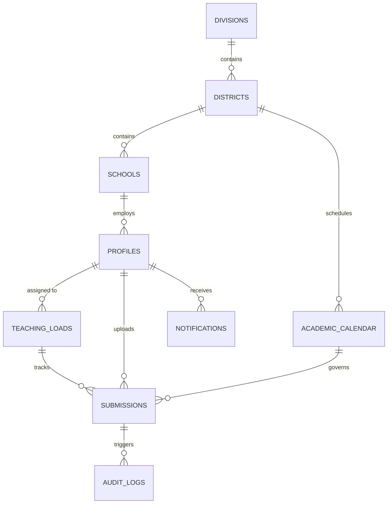

# Database Design (Chapter 3)

The Smart E-VISION 2.0 database is built on Supabase PostgreSQL, utilizing a relational structure to manage instructional supervision archiving, institutional hierarchy, and real-time compliance monitoring.

## 1. Entity Relationship Diagram (ERD)

---

## 2. Table Definitions (Vertical Layout)

### A. Auth & Profiles
| Table | `profiles` |
| :--- | :--- |
| **Description** | Extends the authentication system with institutional metadata (Role, School, District). |
| **Columns** | `id` (UUID, PK), `full_name` (Text), `email` (Text), `role` (Enum), `school_id` (FK), `district_id` (FK), `avatar_url` (Text), `is_active` (Boolean), `push_subscription` (JSONB) |

### B. Institutional Hierarchy
| Table | `divisions` \| `districts` \| `schools` |
| :--- | :--- |
| **Description** | Defines the administrative structure of DepEd (Division > District > School). |
| **Key Fields** | `name`, `address`, `avatar_url` (Logos), `division_id`/`district_id` (Hierarchy FKs) |

### C. Academic Management
| Table | `academic_calendar` |
| :--- | :--- |
| **Description** | Stores school year schedules, quarters, and weekly deadlines. |
| **Columns** | `id` (PK), `district_id` (FK), `school_year` (Text), `quarter` (Int), `week_number` (Int), `deadline_date` (Timestamptz) |

| Table | `teaching_loads` |
| :--- | :--- |
| **Description** | Maps teachers to specific subjects and grade levels for targeted archiving. |
| **Columns** | `id` (PK), `user_id` (FK), `grade_level` (Text), `subject` (Text), `is_active` (Boolean) |

### D. Core Archival System
| Table | `submissions` |
| :--- | :--- |
| **Description** | The primary ledger for all archived instructional supervision documents. |
| **Columns** | `id` (PK), `user_id` (FK), `file_name` (Text), `file_path` (S3/R2 Path), `file_hash` (SHA-256), `doc_type` (Enum: DLL, ISP, ISR), `week_number` (Int), `compliance_status` (Enum: compliant, late, non-compliant), `ai_analysis` (JSONB) |

### E. System & Integrity
| Table | `notifications` |
| :--- | :--- |
| **Description** | Facilitates real-time compliance alerts and system feedback to users. |
| **Columns** | `id` (PK), `user_id` (FK), `title` (Text), `message` (Text), `type` (Enum), `read` (Boolean), `link` (Text) |

| Table | `audit_logs` |
| :--- | :--- |
| **Description** | Blockchain-inspired trail for document integrity and system activity. |
| **Columns** | `id` (PK), `user_id` (FK), `action` (Text), `entity_type` (Text), `prev_hash` (Text), `current_hash` (Text) |

| Table | `system_settings` |
| :--- | :--- |
| **Description** | Global configuration thresholds (e.g., submission window length). |
| **Columns** | `id` (PK), `key` (Unique Text), `value` (Text), `updated_by` (FK) |

---

## 3. Data Integrity & Security (RLS)
The system implements **Row Level Security (RLS)** to ensure:
1.  **Teachers** only manage their own archival records.
2.  **School Heads** can only view submissions within their specific school.
3.  **District Supervisors** have read access to all schools within their district.
4.  **Verification** is globally available via `file_hash` lookup for QR-code stamping.
