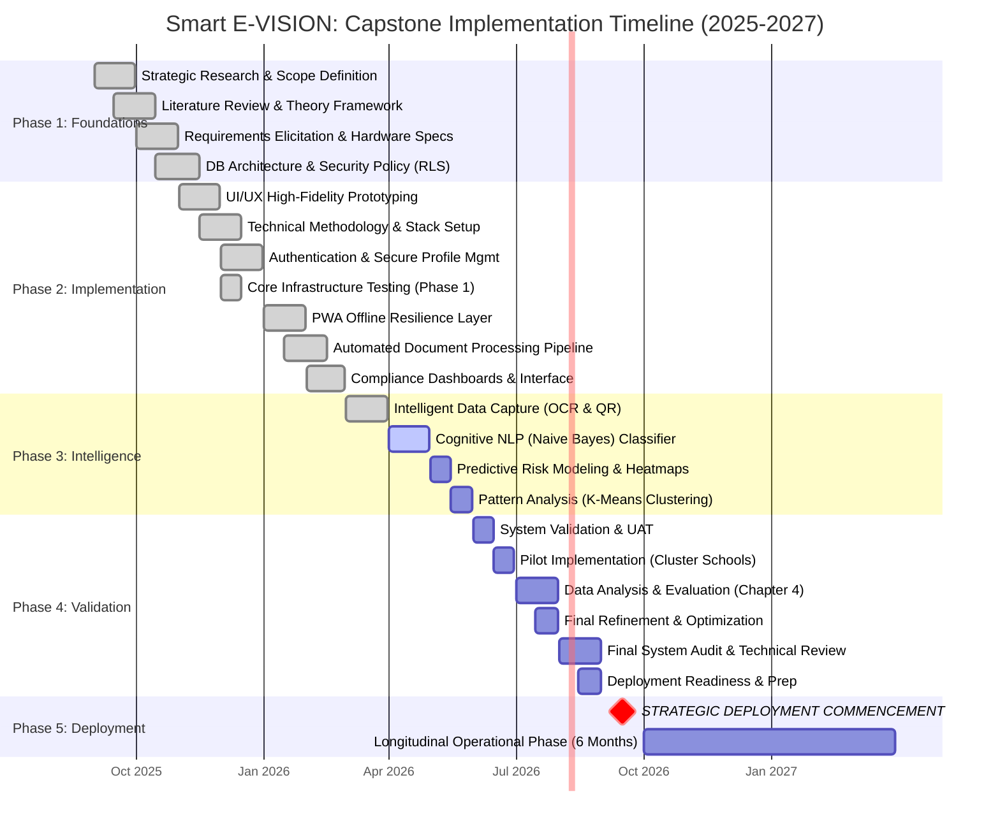

# Smart E-VISION: Project Gantt Chart Data (Mermaid)

This file contains the structural data for the project timeline. You can paste the code below into any Mermaid-compatible viewer.

## Legend
- **Green (Done)**: Completed milestones as of April 2026.
- **Blue (Active)**: Current development focus (Cognitive NLP).
- **Red Line**: Today's Progress Marker (April 12, 2026).
- **Critical (Milestone)**: Official Start of System Deployment (September 2026).
