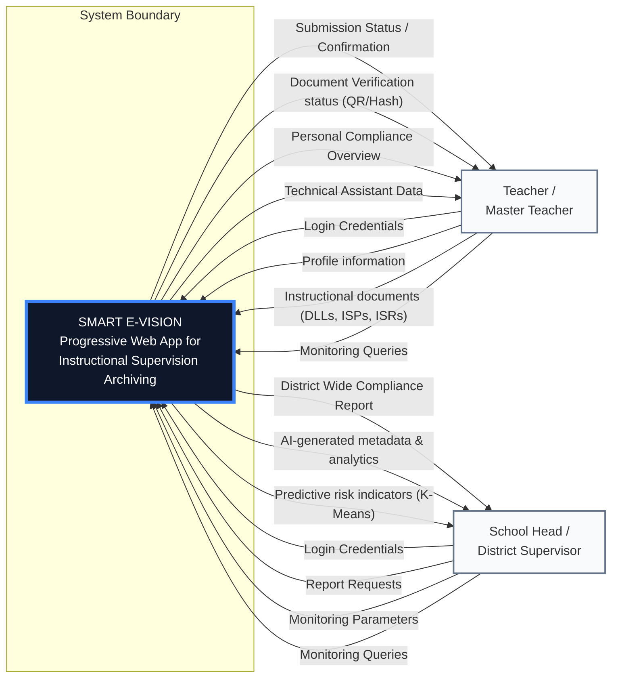
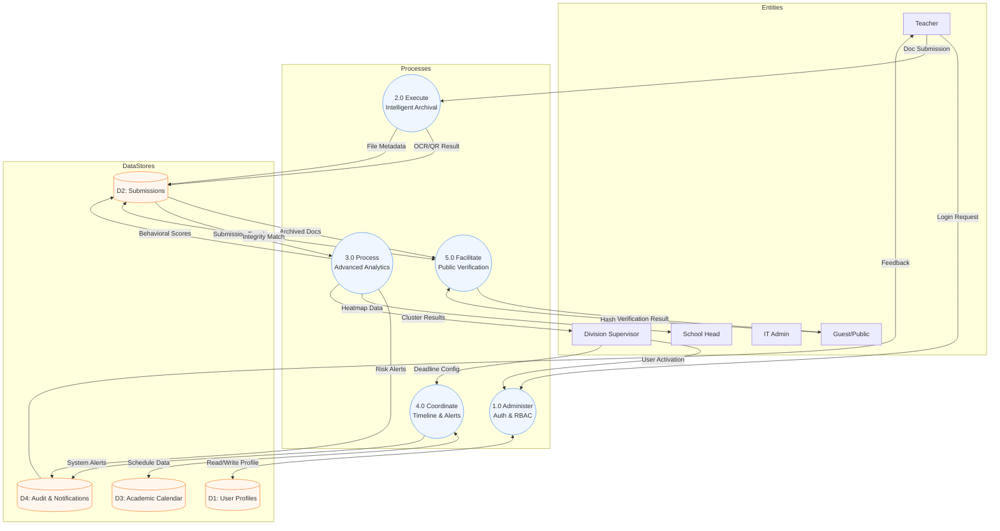

# Smart E-VISION: System Architecture Diagrams (Mermaid)

This document contains the structural definitions for the system's Context Diagram and Data Flow Diagram (DFD) Level 0.

---

## 🔝 1. Context Diagram

The Context Diagram defines the system's boundaries and its interactions with external entities.

---

## 🔄 2. DFD Diagram 0

DFD Level 0 decomposes the system into its primary functional processes and data stores.

